# Sustav za Upravljanje Servisom Vozila (Vehicle Service Management System)

Ovo je web aplikacija razvijena za upravljanje servisima vozila, klijentima i vozilima. Uključuje funkcionalnosti za autentifikaciju (registraciju i prijavu), dodavanje klijenata i vozila, te zakazivanje i pregled servisnih zapisa putem interaktivnog kalendara.

## Sadržaj

* [Tehnologije Korištene](#tehnologije-korištene)
* [Preduvjeti](#preduvjeti)
* [Struktura Projekta](#struktura-projekta)
* [🚀 Pokretanje Aplikacije s Docker Compose (Preporučeno za Brzo Postavljanje)](#-pokretanje-aplikacije-s-docker-compose-preporučeno-za-brzo-postavljanje)
* [💻 Pokretanje Aplikacije Lokalno (Za Razvoj)](#-pokretanje-aplikacije-lokalno-za-razvoj)
* [🌟 Korištenje Aplikacije - Detaljne Upute](#-korištenje-aplikacije---detaljne-upute)
    * [1. Registracija i Prijava](#1-registracija-i-prijava)
    * [2. Početna Stranica (Dashboard)](#2-početna-stranica-dashboard)
    * [3. Upravljanje Servisnim Zadatcima (Taskovima)](#3-upravljanje-servisnim-zadatcima-taskovima)
    * [4. Kreiranje Novog Servisa](#4-kreiranje-novog-servisa)
    * [5. Pregled Kalendara Servisa](#5-pregled-kalendara-servisa)
    * [6. Upravljanje Vozilima](#6-upravljanje-vozilima)
    * [7. Upravljanje Klijentima](#7-upravljanje-klijentima)
    * [8. Pregled Svih Servisa](#8-pregled-svih-servisa)
* [Česta Pitanja (FAQ)](#česta-pitanja-faq)

---

## Tehnologije Korištene

* **Frontend:** React, TypeScript, Axios, React Hook Form, React Query, FullCalendar, React Toastify, Framer Motion, Tailwind CSS
* **Backend:** ASP.NET Core Web API (C#)
* **Baza Podataka:** PostgreSQL
* **Kontejnerizacija:** Docker, Docker Compose

## Preduvjeti

Da biste pokrenuli ovaj projekt, trebat će vam sljedeće instalirano na vašem računalu:

1.  **Git:**
    * Preuzmite i instalirajte s [Git web stranice](https://git-scm.com/downloads).
    * Provjerite radi li Git tako da otvorite terminal/Command Prompt i upišete:
        ```bash
        git --version
        ```
        Trebali biste vidjeti broj verzije.
2.  **Docker Desktop** (ili Docker Engine):
    * Preuzmite i instalirajte s [Docker web stranice](https://www.docker.com/products/docker-desktop/).
    * Provjerite radi li Docker tako da otvorite terminal/Command Prompt i upišete:
        ```bash
        docker --version
        docker compose version
        ```
        Trebali biste vidjeti brojeve verzija.
3.  **(Opcionalno za lokalni frontend/backend razvoj, ali preporučeno):**
    * **Node.js i npm:** Za pokretanje React frontenda lokalno. Preuzmite s [Node.js web stranice](https://nodejs.org/en/download/). Provjerite s `node -v` i `npm -v`.
    * **.NET SDK:** Za pokretanje ASP.NET Core backenda lokalno. Preuzmite s [Microsoft .NET web stranice](https://dotnet.microsoft.com/download). Provjerite s `dotnet --version`.

## Struktura Projekta

Projekt je organiziran u sljedeće glavne mape:

* `VehicleServiceApp/`: Sadrži ASP.NET Core backend API projekt.
* `frontend/`: Sadrži React frontend aplikaciju.
* `docker-compose.yml`: Konfiguracijska datoteka za Docker Compose koja definira kako pokrenuti sve servise (backend, bazu podataka, frontend) zajedno.

---

## 🚀 Pokretanje Aplikacije s Docker Compose (Preporučeno za Brzo Postavljanje)

Ovo je najjednostavniji način za pokretanje cijele aplikacije, jer ne zahtijeva zasebnu instalaciju .NET-a, Node.js-a ili PostgreSQL-a na vašem sustavu.

1.  **Klonirajte ili preuzmite projekt:**
    Ako još niste, preuzmite cijeli projekt na svoje računalo. Ako koristite Git:
    ```bash
    git clone <URL_GitHub_repozitorija>
    cd VehicleServiceApp
    ```
    (Zamijenite `<URL_GitHub_repozitorija>` sa stvarnim URL-om repozitorija na GitHubu).

2.  **Navigirajte do korijena projekta:**
    Otvorite terminal (Command Prompt na Windows, Terminal na macOS/Linux) i navigirajte do glavnog foldera projekta (onog koji sadrži `VehicleServiceApp`, `frontend` i `docker-compose.yml`).
    ```bash
    cd /putanja/do/VehicleServiceApp
    ```

3.  **Pokrenite servise:**
    Iz korijena projekta, izvršite sljedeću naredbu:
    ```bash
    docker-compose up --build -d
    ```
    * `up`: Pokreće sve servise definirane u `docker-compose.yml`.
    * `--build`: Osigurava da se Docker slike izgrade iz vašeg koda (backend i frontend) prije pokretanja. Ovo je važno kada prvi put pokrećete ili kada ste napravili promjene u kodu.
    * `-d`: Pokreće kontejnere u "detached" načinu (u pozadini), tako da možete nastaviti koristiti terminal.

    Ovo će potrajati nekoliko minuta dok se preuzmu potrebne Docker slike (PostgreSQL), izgrade vaše aplikacije i pokrenu svi servisi. Pratite ispis u terminalu.

4.  **Pristup aplikaciji:**
    Nakon što su svi servisi uspješno pokrenuti, aplikacija će biti dostupna u vašem web pregledniku na adresi:
    [http://localhost:3000](http://localhost:3000)

5.  **Perzistencija Podataka (Važno!)**
    Aplikacija koristi PostgreSQL bazu podataka koja se pokreće unutar Dockera. Podaci baze pohranjuju se u Docker "volumenu" nazvanom `pgdata`.

    * **Zaustavljanje aplikacije bez brisanja podataka:**
        Ako želite zaustaviti kontejnere, ali zadržati sve podatke koje ste unijeli (registracije, klijenti, vozila), koristite:
        ```bash
        docker-compose down
        ```
        Sljedeći put kada pokrenete `docker-compose up -d`, baza podataka će biti u istom stanju u kojem ste je ostavili.

    * **Potpuno brisanje i resetiranje aplikacije (uključujući podatke):**
        Ako želite potpuno resetirati aplikaciju na "svježe" stanje (uključujući brisanje svih podataka iz baze), zaustavite kontejnere i obrišite volumene pomoću:
        ```bash
        docker-compose down -v
        ```
        Sljedeći put kada pokrenete `docker-compose up --build -d`, pokrenut će se s praznom bazom podataka.

---

## 💻 Pokretanje Aplikacije Lokalno (Za Razvoj)

Ova metoda zahtijeva da imate Node.js, npm i .NET SDK instalirane na vašem računalu. Baza podataka će i dalje raditi u Dockeru.

1.  **Pokrenite PostgreSQL bazu podataka u Dockeru:**
    Otvorite terminal u korijenu projekta i pokrenite samo `db` servis:
    ```bash
    docker-compose up db -d
    ```
    Ovo će pokrenuti samo PostgreSQL bazu podataka.

2.  **Pokrenite Backend (ASP.NET Core API):**
    * Otvorite **novi terminal** (držite onaj za Docker otvoren).
    * Navigirajte do backend foldera:
        ```bash
        cd VehicleServiceApp
        ```
    * Pokrenite backend API:
        ```bash
        dotnet run
        ```
        Backend će se pokrenuti, vjerojatno na `http://localhost:5026` (provjerite ispis u terminalu).

3.  **Pokrenite Frontend (React App):**
    * Otvorite **još jedan novi terminal** (držite prethodna dva otvorena).
    * Navigirajte do frontend foldera:
        ```bash
        cd frontend
        ```
    * **Instalirajte ovisnosti (samo prvi put):**
        ```bash
        npm install
        ```
    * **Konfigurirajte varijable okruženja:**
        Kreirajte datoteku naziva `.env` u folderu `frontend/`.
        Kopirajte sadržaj iz `frontend/.env.example` u nju.
        Osigurajte da imate sljedeću liniju u vašoj novoj `.env` datoteci:
        ```
        REACT_APP_API_URL=http://localhost:5026
        ```
        (Ako vaš backend radi na drugom portu, prilagodite ovu vrijednost.)

    * **Pokrenite frontend aplikaciju:**
        ```bash
        npm start
        ```
        Ovo će pokrenuti razvojni server i automatski otvoriti aplikaciju u vašem pregledniku na adresi:
        [http://localhost:3000](http://localhost:3000)

4.  **Zaustavljanje lokalnog razvoja:**
    * U svakom terminalu gdje se nešto pokreće (backend, frontend), pritisnite `Ctrl + C` da zaustavite proces.
    * Kada završite, možete zaustaviti i Docker kontejner za bazu podataka:
        ```bash
        cd /putanja/do/VehicleServiceApp
        docker-compose down db
        ```
        (Ponovno, ne koristite `-v` ako želite zadržati podatke u bazi.)

---

## 🌟 Korištenje Aplikacije - Detaljne Upute

Ovaj dio README-a pruža korak-po-korak upute za interakciju s aplikacijom nakon što je uspješno pokrenuta.

### 1. Registracija i Prijava

Nakon pokretanja aplikacije, prva stranica koju ćete vidjeti je stranica za registraciju.

* **Registracija novog korisnika:**
    Unesite tražene podatke za registraciju novog korisnika. Lozinka mora sadržavati **minimalno 6 znakova, barem jedno veliko slovo, jedno malo slovo i barem jedan poseban znak** (npr. `@`, `#`, `!`).
    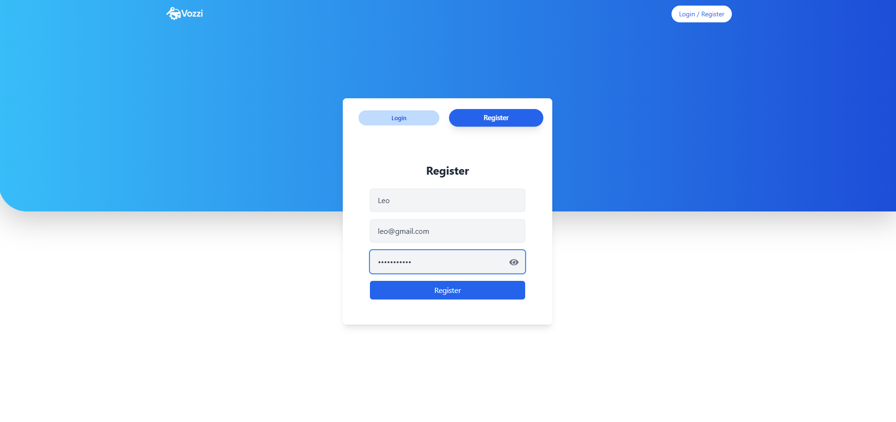

* **Prijava postojećeg korisnika:**
    Nakon uspješne registracije, automatski ćete biti preusmjereni na stranicu za prijavu. Također, možete se prijaviti s već postojećim računom. Koristite svoj email i lozinku koju ste kreirali.

### 2. Početna Stranica (Dashboard)

Nakon uspješne prijave, bit ćete preusmjereni na početnu stranicu aplikacije. Ovdje se nalazi centralni navigacijski sustav s karticama za brzi pristup ključnim funkcionalnostima kao što su Novi Servis, Kalendar Servisa, Vozila, Klijenti, Servisni Zadatci i Svi Servisi. Iste funkcionalnosti su dostupne i putem navigacijske trake (navbar) na vrhu stranice.

* **Povratak na početnu stranicu putem loga:**
    U bilo kojem trenutku možete se vratiti na početnu stranicu klikom na logo aplikacije u gornjem lijevom kutu navigacijske trake.
    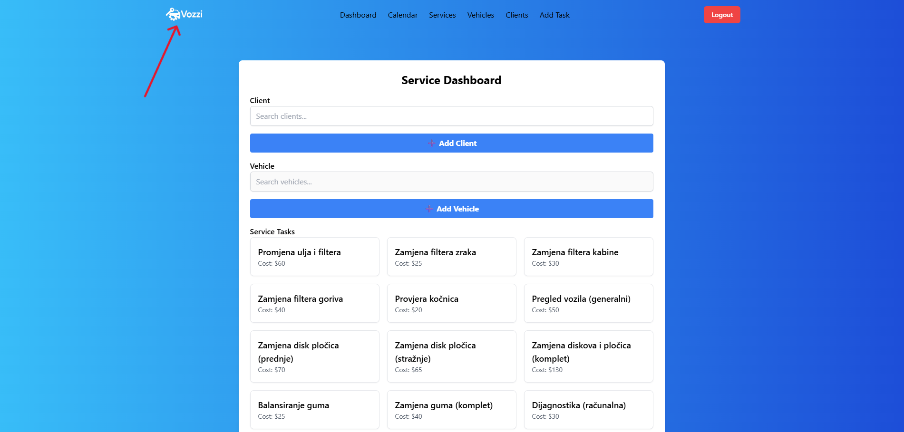

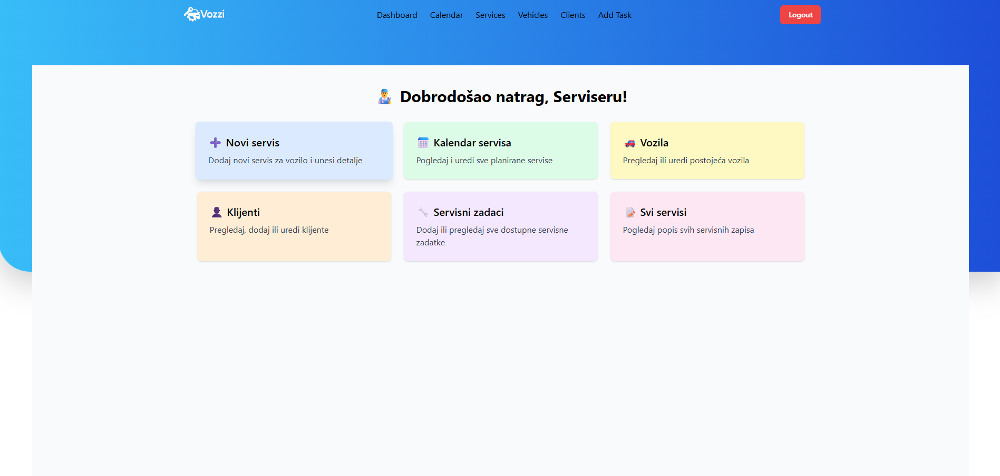

### 3. Upravljanje Servisnim Zadatcima (Taskovima)

Prije nego što započnete s kreiranjem servisa, preporučuje se da dodate nekoliko servisnih zadataka (npr. "Zamjena ulja", "Mijenjanje guma", "Balansiranje") s pripadajućim cijenama. Ovi zadatci će biti dostupni za odabir prilikom kreiranja novog servisa.

* **Pristup stranici za servisne zadatke:**
    Kliknite na karticu "Servisni zadatci" na početnoj stranici ili odaberite "Servisni zadatci" iz navigacijske trake.
    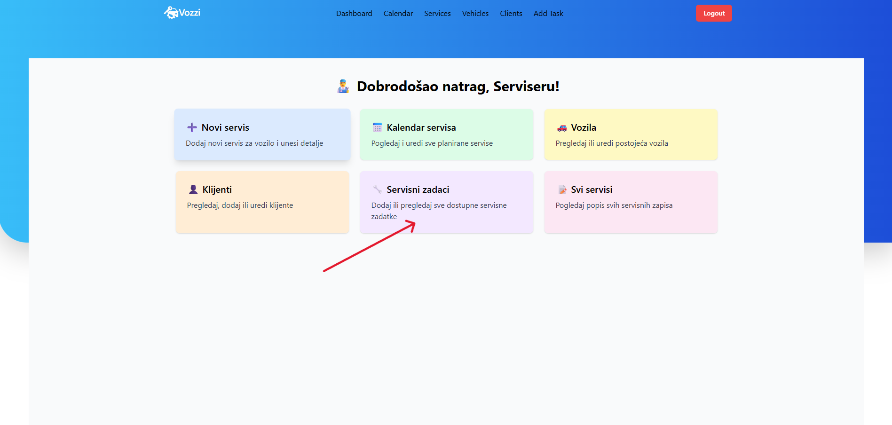

* **Dodavanje novog servisnog zadatka:**
    Na ovoj stranici možete unijeti naziv novog servisnog zadatka i njegovu cijenu.
    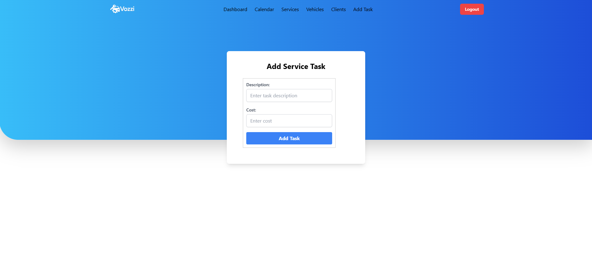

### 4. Kreiranje Novog Servisa

Za zakazivanje novog servisa, kliknite na karticu "Novi Servis" na početnoj stranici.

* **Pristup formi za novi servis:**
    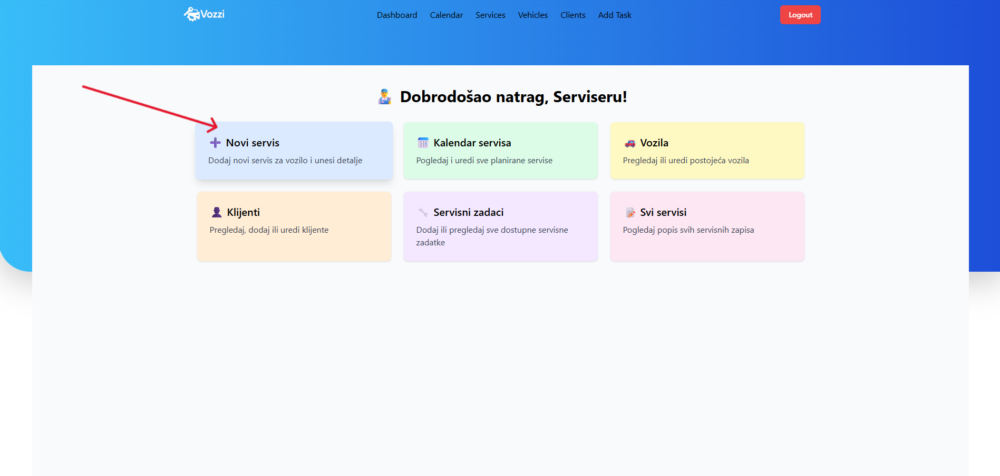

* **Popunjavanje detalja servisa:**
    Na Service Dashboardu možete:
    * Odabrati postojećeg klijenta ili dodati novog.
    * Odabrati postojeće vozilo povezano s klijentom ili dodati novo vozilo za odabranog klijenta.
    * Odabrati jedan ili više servisnih zadataka (taskova) koje ste prethodno definirali.
    * Odrediti datum i vrijeme servisa putem kalendara.
    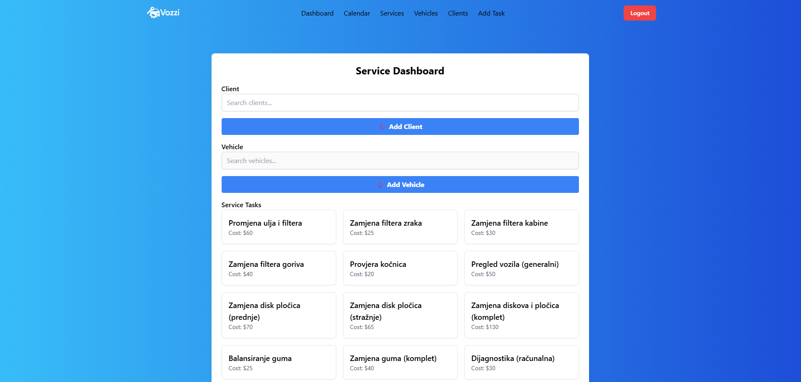
    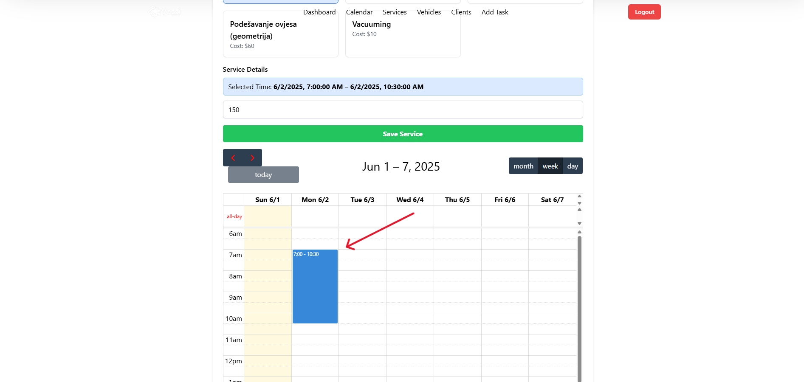

### 5. Pregled Kalendara Servisa

Kalendar pruža vizualni pregled svih zakazanih servisa.

* **Pristup kalendaru:**
    Kliknite na karticu "Kalendar servisa" na početnoj stranici.
    

* **Pregled zakazanih termina:**
    Na kalendaru su prikazani svi vaši zakazani servisi s njihovim terminima.
    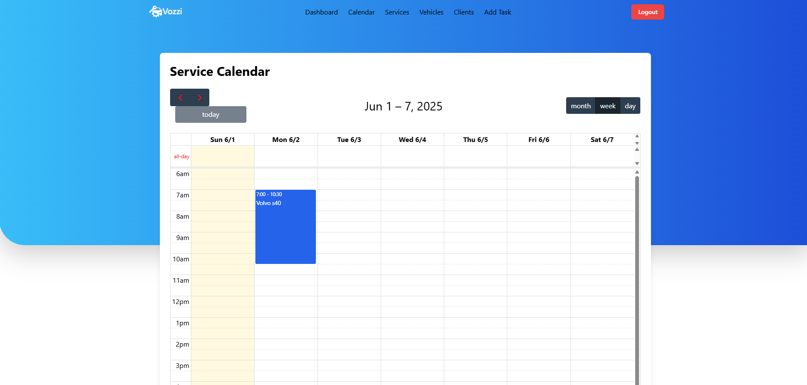

### 6. Upravljanje Vozilima

Pregledajte, uredite ili izbrišite vozila.

* **Pristup listi vozila:**
    Kliknite na karticu "Vozila" na početnoj stranici.
    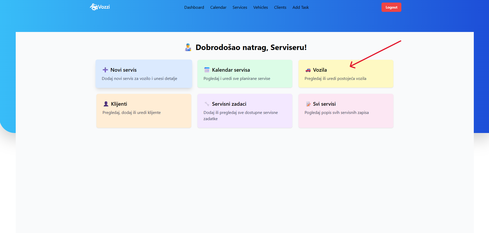

* **Pregled detalja vozila:**
    Svi dodani automobili će biti prikazani. Kliknite na određeno vozilo na listi kako biste otvorili njegove detalje.
    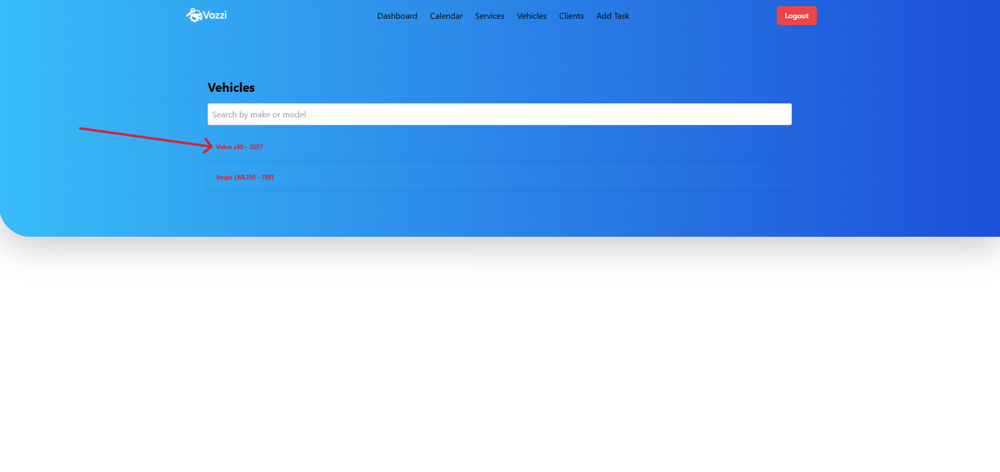

* **Detalji vozila i opcije:**
    Na stranici s detaljima vozila možete vidjeti sve povezane servise i njihove termine. Također, imate opciju uređivanja ili brisanja vozila.
    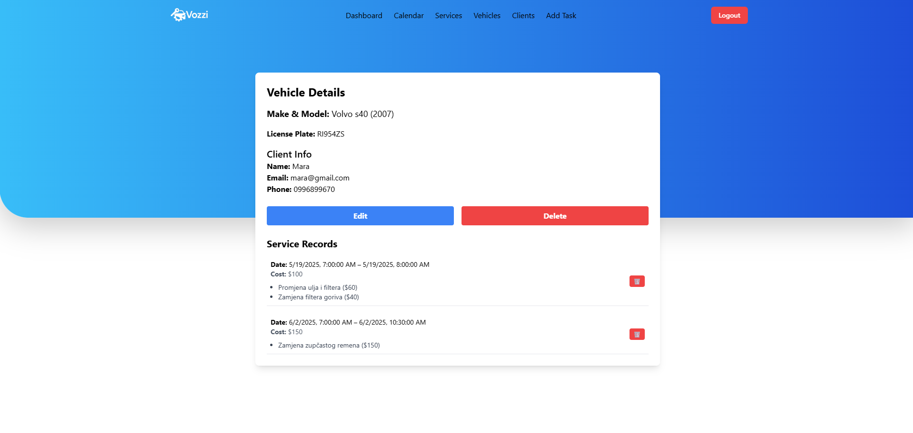

### 7. Upravljanje Klijentima

Pregledajte, uredite ili izbrišite klijente.

* **Pristup listi klijenata:**
    Kliknite na karticu "Klijenti" na početnoj stranici.
    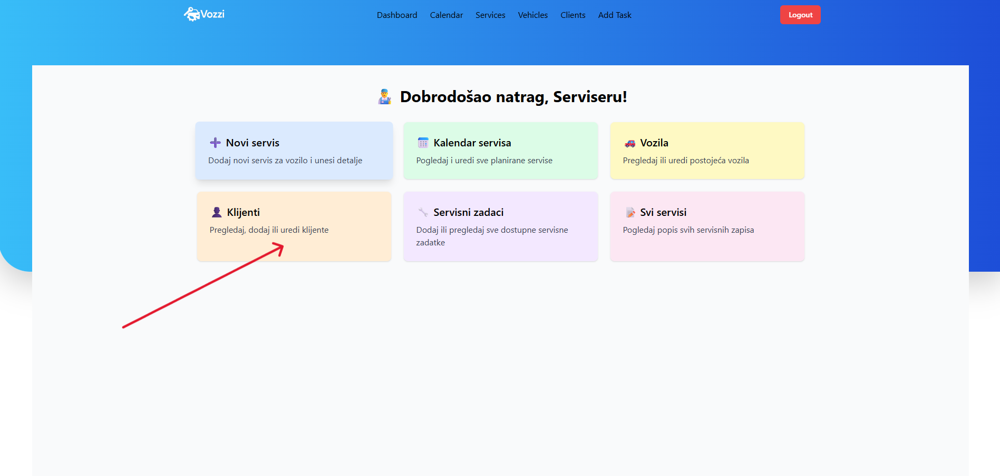

* **Detalji klijenta i opcije:**
    Na stranici s detaljima klijenta možete pregledati njegove podatke te imate opciju uređivanja ili brisanja klijenta.
    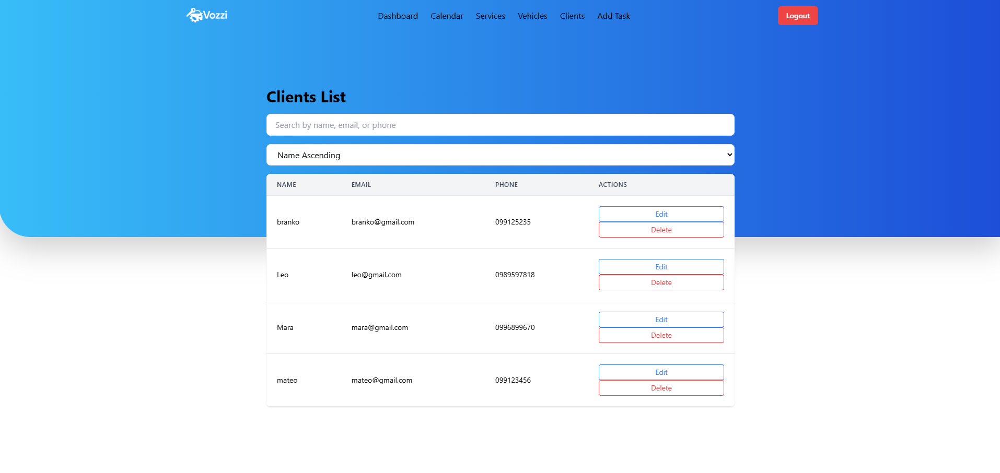

### 8. Pregled Svih Servisa

Ova sekcija prikazuje sve kreirane servisne zapise u obliku liste.

* **Pristup listi svih servisa:**
    Kliknite na karticu "Svi Servisi" na početnoj stranici.
    

* **Pregled i upravljanje servisima:**
    Ovdje možete vidjeti sve servisne zapise, koja su vozila povezana s kojim servisom, te njihove zakazane termine. Također imate opciju brisanja pojedinog servisnog zapisa.
    

---

## Česta Pitanja (FAQ)

* **Zašto dobivam "401 Unauthorized" grešku nakon prijave?**
    Ovo se obično događa ako token za autentifikaciju nije ispravno spremljen ili poslan s naknadnim zahtjevima. Provjerite da je `REACT_APP_API_URL` ispravno konfiguriran i da vaša aplikacija ispravno rukuje tokenima u `localStorage`.
* **Zašto se moji podaci iz baze gube svaki put kada pokrenem Docker Compose?**
    Vjerojatno koristite `docker-compose down -v` što briše Docker volumene (gdje se podaci baze pohranjuju). Koristite samo `docker-compose down` da biste zadržali podatke.
* **Aplikacija ne radi, a u konzoli preglednika vidim "CORS error"?**
    To znači da vaš backend (ASP.NET Core) ne dopušta zahtjeve s domene na kojoj se frontend nalazi. Provjerite CORS konfiguraciju u vašem ASP.NET Core startup kodu da dopušta `http://localhost:3000`. (U ovom projektu bi to trebalo biti već konfigurirano, ali ako naiđete na problem, ovo je čest uzrok.)
